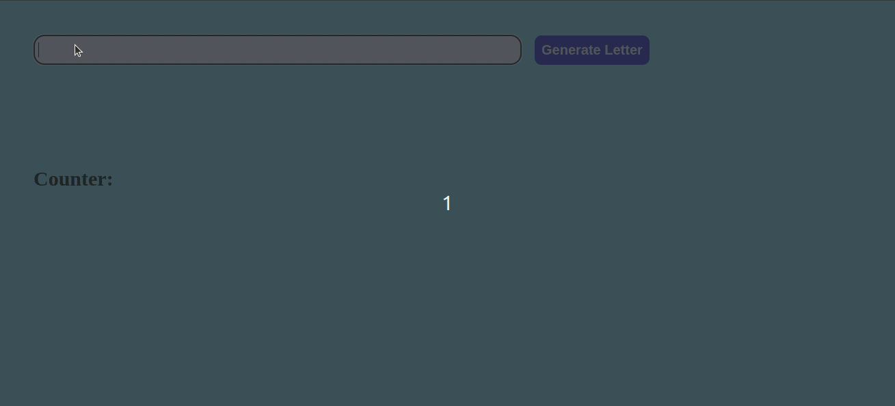

# Mystery Letter Project!

## Description
Project developed during the Trybe software development course.
This project consists of a website that generates mystery letters.

## Tools

- Javascript ES6;
- HTML5;
- CSS3.

# Skills Developed

- DOM manipulation with Javascript;
- Use of CSS and HTML.
